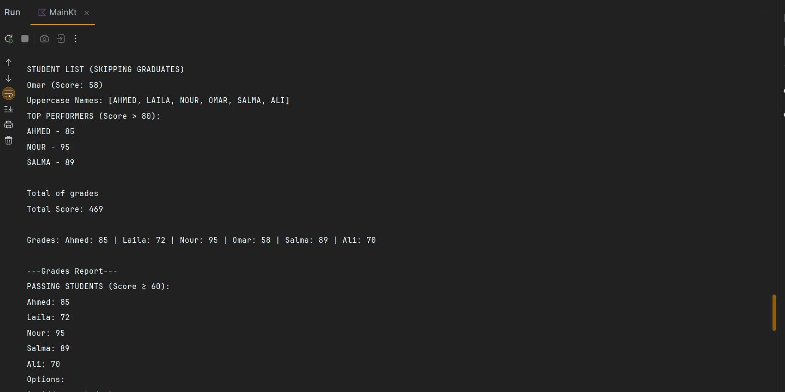

# 🎓 Student Record App (Kotlin Console Project)

This is a beginner-friendly Kotlin console application to manage student records.  
It allows you to:

- Add students with scores
- Show passed and failed students
- Print reports
- Perform filtering and score analysis
- Start with dummy data and extend via user input

---

## 📸 App Preview

Below are screenshots demonstrating different parts of the console app in action.

> All images are scaled equally using HTML-style markdown for consistency.

<div align="center">
  
  
  
  
  
  
  
</div>

---

## 🧪 How to Run

> You need Kotlin installed. You can run it with IntelliJ IDEA or the command line.

### Option 1: IntelliJ IDEA
1. Open the project folder.
2. Run `main()` from the `Main.kt` file.

### Option 2: CLI (Command Line)
```bash
kotlinc Main.kt -include-runtime -d student-app.jar
java -jar student-app.jar
